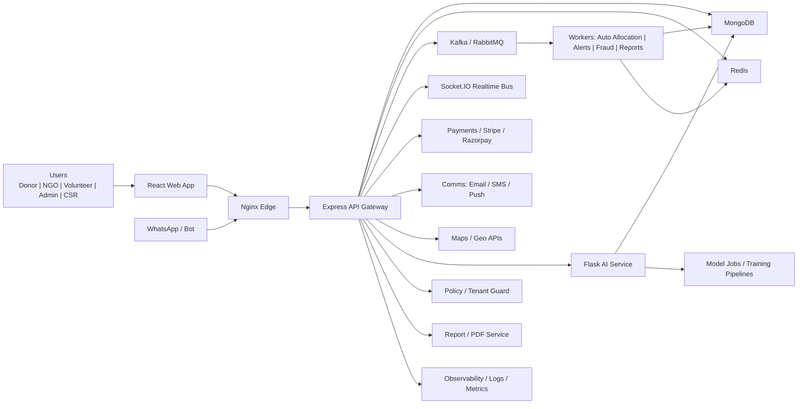
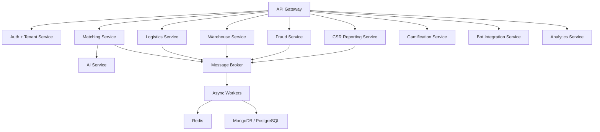

# System Architecture

## High-Level View

## Service Boundaries

- `api-gateway`: auth, RBAC, donations, matching, logistics, analytics, finance, admin, audit
- `ai-service`: smart matching, demand forecasting, expiry-risk estimation, anomaly scoring, food-image quality analysis
- `web`: role-aware dashboards, operations console, analytics, donation flows
- `redis`: cache, pub/sub, queue coordination, token blacklist, notification fanout
- `mongodb`: operational source of truth with geospatial indexes and TTL where appropriate
- `broker`: Kafka or RabbitMQ for event-driven automation, retries, and high-volume asynchronous workflows
- `workers`: auto-allocation, geo-fence fanout, PDF export, fraud pipeline, leaderboard recalculation
- `tenant-control`: tenant policy, data partitioning, per-tenant admin controls, rate limits, and branding

## Scalability Pattern

- Stateless API layer for horizontal scaling behind Nginx and cloud load balancers
- Redis used for hot reads, queues, and realtime fanout
- MongoDB sharding and read replicas for donation and search-heavy workloads
- S3-compatible object storage for food images and audit exports
- Async jobs for notifications, fraud scans, analytics aggregation, and model retraining
- Event-driven modules decoupled with topic queues such as `donation.created`, `match.timeout`, `delivery.updated`, and `fraud.flagged`
- Tenant-aware indexes combining `tenantId`, geo fields, status, and expiry windows for query isolation at scale

## Enterprise Microservices View

## Critical Flows

1. Donor publishes food batch
2. Matching engine scores eligible NGOs using distance, urgency, response latency, and historical acceptance
3. Auto-allocation worker starts SLA timer and reassigns if the top NGO ignores the request
4. Logistics service schedules pickup, warehouse hop if needed, and assigns volunteer
5. Volunteer streams live status and location over websocket channels partitioned by tenant and delivery
6. Fraud service evaluates patterns and flags suspicious actors asynchronously
7. CSR analytics and audit modules publish impact, CO2, and compliance records

## Geo-Intelligence Layer

- Geospatial queries on donation origin, NGO service area, warehouses, and volunteer coverage
- Heatmap aggregations for high waste, high demand, and delayed delivery clusters
- Geo-fencing workflow that notifies eligible NGOs within a configurable radius around a donation

## Multi-Tenant SaaS Model

- Shared services with strict tenant isolation at request, cache, document, and event levels
- Tenant context derived from signed token claims plus `x-tenant-id` verification
- Per-tenant admin dashboards, quotas, feature flags, and audit scopes
