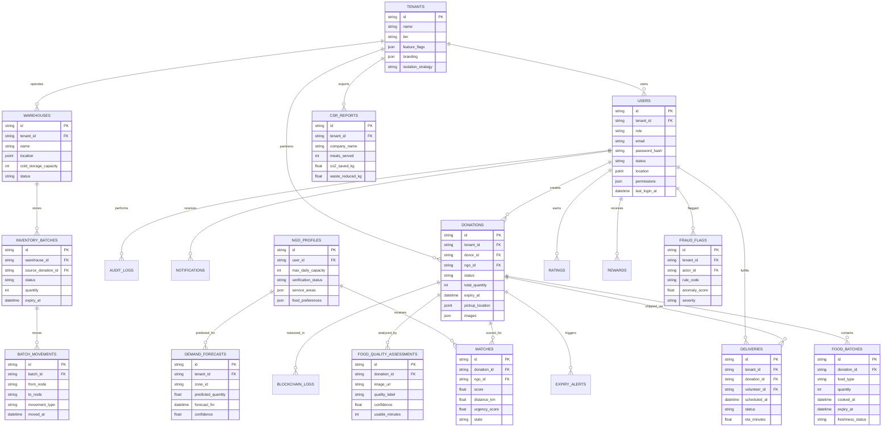

# Database Schema

## ER Diagram

## Collections / Tables

- MongoDB primary collections: `tenants`, `users`, `ngoProfiles`, `donations`, `matches`, `deliveries`, `warehouses`, `inventoryBatches`, `batchMovements`, `fraudFlags`, `qualityAssessments`, `notifications`, `auditLogs`, `payments`
- Redis keys: session refresh tokens, throttles, socket presence, tenant cache, allocation timers, geo-fence fanout, analytics cache
- Optional PostgreSQL tables: `payment_ledger`, `expense_entries`, `reconciliation_runs`, `csr_exports`, `blockchain_anchor_jobs`
- Recommended indexes:
  - `donations`: `{ tenantId: 1, status: 1, expiryAt: 1 }`, `pickupLocation: 2dsphere`
  - `ngoProfiles`: `{ tenantId: 1, verificationStatus: 1 }`, `serviceAreas: 2dsphere`
  - `deliveries`: `{ tenantId: 1, status: 1, scheduledAt: 1 }`
  - `fraudFlags`: `{ tenantId: 1, severity: 1, createdAt: -1 }`
